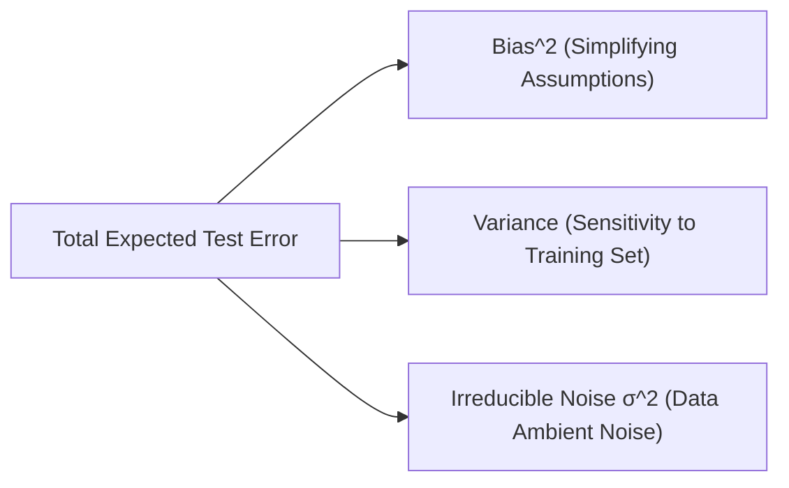

# Bias-Variance Trade-Off, VC-Dimension & PAC Learning Foundations

[← Back to Course README](../README.md)

- [1. Mathematical Derivation of Bias-Variance Decomposition](#1-mathematical-derivation-of-bias-variance-decomposition)
- [2. Vapnik-Chervonenkis (VC) Dimension & Shattering Theory](#2-vapnik-chervonenkis-vc-dimension-shattering-theory)
  - [2.1 Shattering Definition & Growth Function](#21-shattering-definition-growth-function)
  - [2.2 VC-Dimension for Standard Classifiers](#22-vc-dimension-for-standard-classifiers)
  - [2.3 Sauer-Shelah Lemma](#23-sauer-shelah-lemma)
- [3. Probably Approximately Correct (PAC) Learning Framework](#3-probably-approximately-correct-pac-learning-framework)
  - [3.1 Finite Hypothesis Spaces](#31-finite-hypothesis-spaces)
  - [3.2 Infinite Hypothesis Spaces & Sample Complexity](#32-infinite-hypothesis-spaces-sample-complexity)
- [4. Generalization Error Bounds](#4-generalization-error-bounds)
- [5. Python Numerical Simulator: Bias-Variance Decomposition](#5-python-numerical-simulator-bias-variance-decomposition)
- [6. Industry Case Study: Polynomial Model Complexity Tuning](#6-industry-case-study-polynomial-model-complexity-tuning)
- [7. 5 Solved Analytical & Numerical Practice Questions](#7-5-solved-analytical-numerical-practice-questions)
  - [Question 1: Bias-Variance Decomposition Calculation](#question-1-bias-variance-decomposition-calculation)
  - [Question 2: PAC Learning Finite Sample Size](#question-2-pac-learning-finite-sample-size)
  - [Question 3: VC-Dimension of 2D Hyperplanes](#question-3-vc-dimension-of-2d-hyperplanes)
  - [Question 4: Generalization Error Bound Penalty](#question-4-generalization-error-bound-penalty)
  - [Question 5: Polynomial Bound via Sauer-Shelah Lemma](#question-5-polynomial-bound-via-sauer-shelah-lemma)
> **Topic**: Bias-Variance Trade-Off, VC-Dimension & PAC Learning Foundations: 1. Mathematical Derivation of Bias-Variance Decomposition, 2. Vapnik-Chervonenkis (VC) Dimension & Shattering Theory, 3. Probably Approximately Correct (PAC) Learning Framework, 4. Generalization Error Bounds

---

## 1. Mathematical Derivation of Bias-Variance Decomposition

Let target variable $y = f(\mathbf{x}) + \epsilon$, where $\epsilon \sim \mathcal{N}(0, \sigma^2)$ is zero-mean noise with variance $\mathbb{E}[\epsilon^2] = \sigma^2$ independent of $\mathbf{x}$.
Let $\hat{f}(\mathbf{x}; D)$ be estimator trained on dataset $D$. The expected MSE at query point $\mathbf{x}$ over random training sets $D$ is:

$$\mathbb{E}_D \left[ (y - \hat{f}(\mathbf{x}; D))^2 \right] = \mathbb{E}_D \left[ (f(\mathbf{x}) + \epsilon - \hat{f}(\mathbf{x}; D))^2 \right]$$

Expanding terms inside expectation:

$$\mathbb{E}_D \left[ (f(\mathbf{x}) - \hat{f}(\mathbf{x}; D))^2 + 2\epsilon(f(\mathbf{x}) - \hat{f}(\mathbf{x}; D)) + \epsilon^2 \right]$$

Since $\epsilon$ is independent of $D$ and $\mathbb{E}[\epsilon] = 0$, cross-term vanishes:

$$\mathbb{E}_D \left[ (y - \hat{f}(\mathbf{x}; D))^2 \right] = \mathbb{E}_D \left[ (f(\mathbf{x}) - \hat{f}(\mathbf{x}; D))^2 \right] + \sigma^2$$

Adding and subtracting expected prediction $\bar{f}(\mathbf{x}) = \mathbb{E}_D[\hat{f}(\mathbf{x}; D)]$ inside square:

$$\mathbb{E}_D \left[ (f(\mathbf{x}) - \bar{f}(\mathbf{x}) + \bar{f}(\mathbf{x}) - \hat{f}(\mathbf{x}; D))^2 \right]$$

$$= (f(\mathbf{x}) - \bar{f}(\mathbf{x}))^2 + \mathbb{E}_D \left[ (\bar{f}(\mathbf{x}) - \hat{f}(\mathbf{x}; D))^2 \right] + 2(f(\mathbf{x}) - \bar{f}(\mathbf{x})) \underbrace{\mathbb{E}_D [\bar{f}(\mathbf{x}) - \hat{f}(\mathbf{x}; D)]}_{= 0}$$

Combining terms yields the fundamental decomposition:

$$\mathbb{E}_D \left[ (y - \hat{f}(\mathbf{x}))^2 \right] = \underbrace{(f(\mathbf{x}) - \mathbb{E}_D[\hat{f}(\mathbf{x})])^2}_{\text{Bias}[\hat{f}(\mathbf{x})]^2} + \underbrace{\mathbb{E}_D \left[ (\hat{f}(\mathbf{x}) - \mathbb{E}_D[\hat{f}(\mathbf{x})])^2 \right]}_{\text{Var}[\hat{f}(\mathbf{x})]} + \underbrace{\sigma^2}_{\text{Irreducible Noise}}$$



---

## 2. Vapnik-Chervonenkis (VC) Dimension & Shattering Theory

### 2.1 Shattering Definition & Growth Function
Let $C = \{\mathbf{x}_1, \dots, \mathbf{x}_n\} \subset \mathcal{X}$ be a set of $n$ points. Hypothesis space $\mathcal{H}$ **shatters** $C$ if $\mathcal{H}$ can realize all $2^n$ possible binary labelings on $C$.

The **Growth Function** $\Pi_{\mathcal{H}}(n)$ measures maximum number of distinct labelings $\mathcal{H}$ can assign to any $n$ points:

$$\Pi_{\mathcal{H}}(n) = \max_{C \subset \mathcal{X}, |C|=n} |\{ (h(\mathbf{x}_1), \dots, h(\mathbf{x}_n)) : h \in \mathcal{H} \}| \le 2^n$$

The **VC-Dimension** $d_{\text{VC}}(\mathcal{H})$ is the maximum size $n$ of a point set that can be shattered by $\mathcal{H}$:

$$d_{\text{VC}}(\mathcal{H}) = \max \{ n : \Pi_{\mathcal{H}}(n) = 2^n \}$$

### 2.2 VC-Dimension for Standard Classifiers
1. **1D Intervals ($a \le x \le b$)**: $d_{\text{VC}} = 2$.
2. **$d$-Dimensional Hyperplanes ($w_0 + \mathbf{w}^T \mathbf{x} = 0$)**: $d_{\text{VC}} = d + 1$.
3. **Axis-Aligned Hyper-rectangles in $\mathbb{R}^d$**: $d_{\text{VC}} = 2d$.
4. **Sine Function $h(x) = \text{sign}(\sin(\omega x))$ ($\omega \in \mathbb{R}$)**: $d_{\text{VC}} = \infty$ (Infinite VC dimension despite single parameter!).

### 2.3 Sauer-Shelah Lemma
If $d_{\text{VC}}(\mathcal{H}) = d < \infty$, then for all $n > d$, growth function $\Pi_{\mathcal{H}}(n)$ is bounded polynomially rather than exponentially:

$$\Pi_{\mathcal{H}}(n) \le \sum_{i=0}^d \binom{n}{i} \le \left( \frac{e n}{d} \right)^d$$

---

## 3. Probably Approximately Correct (PAC) Learning Framework

A concept class $\mathcal{C}$ is **PAC-learnable** if there exists algorithm $\mathcal{A}$ such that for all $c \in \mathcal{C}$, distributions $\mathcal{D}$, $\epsilon \in (0, 1/2)$, and $\delta \in (0, 1/2)$, $\mathcal{A}$ outputs hypothesis $h \in \mathcal{H}$ with sample size $n = \text{poly}(1/\epsilon, 1/\delta, d)$ satisfying:

$$P\left( R_{\mathcal{D}}(h) \le \epsilon \right) \ge 1 - \delta$$

### 3.1 Finite Hypothesis Spaces
For finite hypothesis space $|\mathcal{H}| < \infty$, sample complexity $n$ required to guarantee $\epsilon$-accuracy with confidence $1 - \delta$ is:

$$n \ge \frac{1}{\epsilon} \left( \ln|\mathcal{H}| + \ln\left(\frac{1}{\delta}\right) \right)$$

### 3.2 Infinite Hypothesis Spaces & Sample Complexity
For infinite hypothesis space measured by VC-dimension $d = d_{\text{VC}}(\mathcal{H})$, sample complexity bound is:

$$n \ge C \cdot \frac{d + \ln(1/\delta)}{\epsilon}$$

---

## 4. Generalization Error Bounds

With probability at least $1 - \delta$ over training samples of size $n$, for all $h \in \mathcal{H}$:

$$R_{\mathcal{D}}(h) \le \hat{R}_S(h) + \sqrt{\frac{8 d_{\text{VC}} \ln(2n / d_{\text{VC}}) + 8 \ln(4 / \delta)}{n}}$$

---

## 5. Python Numerical Simulator: Bias-Variance Decomposition

```python
import numpy as np
import matplotlib.pyplot as plt
from sklearn.pipeline import make_pipeline
from sklearn.preprocessing import PolynomialFeatures
from sklearn.linear_model import LinearRegression

# Target function f(x) = sin(pi * x) with noise sigma = 0.2
def true_f(x):
    return np.sin(np.pi * x)

np.random.seed(42)
n_experiments = 200
n_samples = 25
x_test = np.linspace(-1, 1, 100)
y_test_true = true_f(x_test)

degrees = [1, 3, 9]
results = {}

for deg in degrees:
    predictions = np.zeros((n_experiments, len(x_test)))
    
    for i in range(n_experiments):
        x_train = np.random.uniform(-1, 1, n_samples)
        y_train = true_f(x_train) + np.random.normal(0, 0.2, n_samples)
        
        model = make_pipeline(PolynomialFeatures(deg), LinearRegression())
        model.fit(x_train.reshape(-1, 1), y_train)
        predictions[i, :] = model.predict(x_test.reshape(-1, 1))
        
    avg_prediction = np.mean(predictions, axis=0)
    bias_sq = (avg_prediction - y_test_true) ** 2
    variance = np.mean((predictions - avg_prediction) ** 2, axis=0)
    
    results[deg] = {
        'bias_sq': np.mean(bias_sq),
        'variance': np.mean(variance),
        'total_error': np.mean(bias_sq) + np.mean(variance) + 0.04
    }

df_bv = pd.DataFrame(results).T
df_bv.index.name = 'Poly Degree'
print("Bias-Variance Decomposition Results across 200 Experiments:")
print(df_bv)
```

---

## 6. Industry Case Study: Polynomial Model Complexity Tuning

```python
import numpy as np
import pandas as pd
from sklearn.metrics import mean_squared_error

# Synthetic Sensor Thermal Dynamics Calibration
np.random.seed(42)
x_val = np.sort(np.random.uniform(-2, 2, 50))
y_val = 0.5 * x_val**3 - 1.2 * x_val**2 + 0.8 * x_val + np.random.normal(0, 0.5, 50)

# Evaluate Degrees 1 through 6
records = []
for d in range(1, 7):
    p = np.polyfit(x_val, y_val, deg=d)
    y_pred = np.polyval(p, x_val)
    mse = mean_squared_error(y_val, y_pred)
    records.append({'Degree': d, 'MSE': mse})

df_poly = pd.DataFrame(records)
print("Polynomial Complexity Tuning Curve:")
print(df_poly)
```

---

## 7. 5 Solved Analytical & Numerical Practice Questions

### Question 1: Bias-Variance Decomposition Calculation
**Problem**: Target value $y = 10.0$ with noise variance $\sigma^2 = 2.25$. Estimator predictions across 4 training runs are `[8.0, 8.5, 9.0, 8.5]`. Calculate Bias$^2$, Variance, and Total Expected Test Error.
```python
# Solution
import numpy as np

y_true = 10.0
sigma2 = 2.25
preds = np.array([8.0, 8.5, 9.0, 8.5])

f_bar = np.mean(preds) # 8.5
bias_sq = (f_bar - y_true) ** 2 # (-1.5)^2 = 2.25
var = np.mean((preds - f_bar) ** 2) # ((0.25 + 0 + 0.25 + 0)/4) = 0.125
total_err = bias_sq + var + sigma2

print(f"Question 1 -> Bias^2: {bias_sq:.4f}, Variance: {var:.4f}, Total Error: {total_err:.4f}")
```

### Question 2: PAC Learning Finite Sample Size
**Problem**: Hypothesis space $|\mathcal{H}| = 50,000$. Compute minimum sample size $n$ required for $\epsilon = 0.05$ and confidence $1 - \delta = 0.99$ ($\delta = 0.01$).
```python
# Solution
import math

size_H = 50000
eps = 0.05
delta = 0.01

n_req = (1.0 / eps) * (math.log(size_H) + math.log(1.0 / delta))
print(f"Question 2 -> Required PAC Sample Size n: {math.ceil(n_req)}") # 20 * (10.8197 + 4.6052) = 309
```

### Question 3: VC-Dimension of 2D Hyperplanes
**Problem**: State the VC-dimension of 2D linear hyperplanes ($w_0 + w_1 x_1 + w_2 x_2 = 0$) and explain why 4 points in XOR configuration cannot be shattered.
```python
# Solution
d_space = 2
d_vc = d_space + 1
print(f"Question 3 -> VC-Dimension of 2D Linear Classifier: {d_vc}")
print("XOR configuration requires non-linear boundary; linear hyperplane cannot separate opposite diagonal pairs.")
```

### Question 4: Generalization Error Bound Penalty
**Problem**: For classifier with $d_{\text{VC}} = 5$ trained on $n = 2000$ samples with $\delta = 0.05$, compute generalization error bound penalty term $\epsilon_{\text{bound}}$.
```python
# Solution
import math

d_vc = 5
n_samples = 2000
delta = 0.05

val_inside = (8.0 * d_vc * math.log(2.0 * n_samples / d_vc) + 8.0 * math.log(4.0 / delta)) / n_samples
bound_penalty = math.sqrt(val_inside)
print(f"Question 4 -> Generalization Error Bound Penalty: {bound_penalty:.4f}")
```

### Question 5: Polynomial Bound via Sauer-Shelah Lemma
**Problem**: Compute upper bound on growth function $\Pi_{\mathcal{H}}(n) \le \left( \frac{e n}{d} \right)^d$ for $n = 100$ and $d_{\text{VC}} = 3$.
```python
# Solution
import math

n = 100
d = 3
bound_sauer = ((math.e * n) / d) ** d
print(f"Question 5 -> Growth Function Upper Bound: {bound_sauer:.2f}") # (271.828/3)^3 = 744,383.15
```
