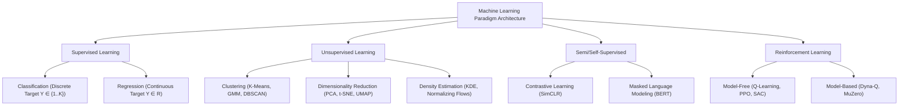

# Machine Learning Paradigms, Foundations & Perspectives

[← Back to Course README](../README.md)

- [1. Comprehensive Machine Learning Taxonomy](#1-comprehensive-machine-learning-taxonomy)
- [2. Deep Dive into Primary Paradigms](#2-deep-dive-into-primary-paradigms)
  - [2.1 Supervised Learning (Classification & Regression)](#21-supervised-learning-classification-regression)
  - [2.2 Unsupervised Learning (Clustering, Density, Reduction)](#22-unsupervised-learning-clustering-density-reduction)
  - [2.3 Semi-Supervised & Self-Supervised Learning](#23-semi-supervised-self-supervised-learning)
  - [2.4 Reinforcement Learning & MDP Foundations](#24-reinforcement-learning-mdp-foundations)
- [3. Core Perspectives, Trade-Offs & Open Issues](#3-core-perspectives-trade-offs-open-issues)
  - [3.1 Representation vs Optimization vs Generalization](#31-representation-vs-optimization-vs-generalization)
  - [3.2 The Curse of Dimensionality](#32-the-curse-of-dimensionality)
  - [3.3 Data Distribution Shifts & Dataset Bias](#33-data-distribution-shifts-dataset-bias)
- [4. Mathematical Framework for Hypothesis Evaluation](#4-mathematical-framework-for-hypothesis-evaluation)
  - [4.1 Empirical Risk Minimization (ERM)](#41-empirical-risk-minimization-erm)
  - [4.2 Structural Risk Minimization (SRM)](#42-structural-risk-minimization-srm)
- [5. Python Mechanics: Custom ERM Simulator & Scikit-Learn Pipelines](#5-python-mechanics-custom-erm-simulator-scikit-learn-pipelines)
- [6. End-to-End Industry Case Study: Credit Risk Default Engine](#6-end-to-end-industry-case-study-credit-risk-default-engine)
  - [Scenario Pipeline](#scenario-pipeline)
- [7. 5 Solved Practice & Analytical Numerical Questions](#7-5-solved-practice-analytical-numerical-questions)
  - [Question 1: Empirical Risk under 0/1 Loss](#question-1-empirical-risk-under-01-loss)
  - [Question 2: Expected Discounted Return in Reinforcement Learning](#question-2-expected-discounted-return-in-reinforcement-learning)
  - [Question 3: Structural Risk Minimization Value](#question-3-structural-risk-minimization-value)
  - [Question 4: Log Loss Empirical Risk Calculation](#question-4-log-loss-empirical-risk-calculation)
  - [Question 5: Covariate Shift Detection via Density Ratios](#question-5-covariate-shift-detection-via-density-ratios)
> **Topic**: Machine Learning Paradigms, Foundations & Perspectives: 1. Comprehensive Machine Learning Taxonomy, 2. Deep Dive into Primary Paradigms, 3. Core Perspectives, Trade-Offs & Open Issues, 4. Mathematical Framework for Hypothesis Evaluation

---

## 1. Comprehensive Machine Learning Taxonomy

Machine Learning (ML) is defined by Tom Mitchell (1997) as:
> *A computer program is said to learn from experience $E$ with respect to some class of tasks $T$ and performance measure $P$, if its performance at tasks in $T$, as measured by $P$, improves with experience $E$.*



---

## 2. Deep Dive into Primary Paradigms

### 2.1 Supervised Learning (Classification & Regression)
Given training set $\mathcal{D} = \{(\mathbf{x}_i, y_i)\}_{i=1}^n$ drawn i.i.d. from unknown joint distribution $\mathcal{P}(\mathbf{X}, Y)$, the objective is to learn prediction function $f: \mathcal{X} \to \mathcal{Y}$ in hypothesis space $\mathcal{H}$ minimizing expected loss:

$$R(f) = \mathbb{E}_{(\mathbf{x}, y) \sim \mathcal{P}}[L(f(\mathbf{x}), y)] = \int_{\mathcal{X} \times \mathcal{Y}} L(f(\mathbf{x}), y) d\mathcal{P}(\mathbf{x}, y)$$

* **Classification ($y_i \in \{1, \dots, K\}$)**: Utilizes zero-one loss $L(f(\mathbf{x}), y) = \mathbb{I}(f(\mathbf{x}) \neq y)$ or cross-entropy loss $L(p, y) = -\log p_y$.
* **Regression ($y_i \in \mathbb{R}$)**: Utilizes squared loss $L(f(\mathbf{x}), y) = (f(\mathbf{x}) - y)^2$ or absolute loss $|f(\mathbf{x}) - y|$.

### 2.2 Unsupervised Learning (Clustering, Density, Reduction)
Given unlabeled dataset $\mathcal{D} = \{\mathbf{x}_i\}_{i=1}^n$ drawn from $\mathcal{P}(\mathbf{X})$, goal is to estimate marginal density $p(\mathbf{x})$, partition samples into latent manifold clusters, or project data into low-dimensional latent space $\mathbf{z} \in \mathbb{R}^k$ ($k \ll d$) preserving distance topology:

$$\min_{E, D} \frac{1}{n} \sum_{i=1}^n \|\mathbf{x}_i - D(E(\mathbf{x}_i))\|^2$$

### 2.3 Semi-Supervised & Self-Supervised Learning
Combines small labeled set $\mathcal{L} = \{(\mathbf{x}_i, y_i)\}_{i=1}^l$ with large unlabeled set $\mathcal{U} = \{\mathbf{x}_j\}_{j=1}^u$ ($u \gg l$). Self-supervised learning creates auxiliary supervisory pretext tasks (e.g., predicting masked tokens or rotated image patches).

### 2.4 Reinforcement Learning & MDP Foundations
Modeled as a Markov Decision Process (MDP) tuple $\mathcal{M} = \langle \mathcal{S}, \mathcal{A}, \mathcal{P}, \mathcal{R}, \gamma \rangle$:
* $\mathcal{S}$: State space.
* $\mathcal{A}$: Action space.
* $\mathcal{P}(s' \mid s, a)$: State transition probability kernel.
* $\mathcal{R}(s, a, s')$: Reward function.
* $\gamma \in [0, 1)$: Discount factor.

The agent learns policy $\pi(a \mid s)$ maximizing expected cumulative discounted return:

$$J(\pi) = \mathbb{E}_{\tau \sim \pi} \left[ \sum_{t=0}^{\infty} \gamma^t r_t \right]$$

---

## 3. Core Perspectives, Trade-Offs & Open Issues

### 3.1 Representation vs Optimization vs Generalization
1. **Representation**: Does hypothesis space $\mathcal{H}$ contain target function $f^*$?
2. **Optimization**: Can numerical optimization algorithms (e.g., SGD, Adam) converge to global minimum $\hat{f} \in \mathcal{H}$?
3. **Generalization**: Does low empirical risk $\hat{R}_S(\hat{f})$ translate to low true risk $R(\hat{f})$ on unseen test samples?

### 3.2 The Curse of Dimensionality
As feature dimension $d$ increases, volume of feature space grows exponentially ($V \propto r^d$), causing sample density to approach zero. Pairwise Euclidean distances become equidistant:

$$\lim_{d \to \infty} \frac{\text{Dist}_{\max} - \text{Dist}_{\min}}{\text{Dist}_{\min}} = 0$$

### 3.3 Data Distribution Shifts & Dataset Bias
* **Covariate Shift**: $P_{train}(\mathbf{X}) \neq P_{test}(\mathbf{X})$, but $P(Y \mid \mathbf{X})$ remains invariant.
* **Prior Probability Shift**: $P_{train}(Y) \neq P_{test}(Y)$, but $P(\mathbf{X} \mid Y)$ remains invariant.
* **Concept Drift**: $P(Y \mid \mathbf{X})$ changes dynamically over time.

---

## 4. Mathematical Framework for Hypothesis Evaluation

### 4.1 Empirical Risk Minimization (ERM)
Empirical risk over training sample $S = \{(\mathbf{x}_i, y_i)\}_{i=1}^n$:

$$\hat{R}_{S}(f) = \frac{1}{n} \sum_{i=1}^n L(f(\mathbf{x}_i), y_i)$$

By Uniform Law of Large Numbers (Vapnik-Chervonenkis theorem), as $n \to \infty$:

$$P\left( \sup_{f \in \mathcal{H}} |R(f) - \hat{R}_S(f)| > \epsilon \right) \le 2 \mathcal{N}(\mathcal{H}, 2n) \exp\left( -\frac{n \epsilon^2}{8} \right)$$

### 4.2 Structural Risk Minimization (SRM)
To prevent overfitting in large hypothesis spaces, SRM penalizes model complexity via regularization function $\Omega(f)$:

$$f^*_{\text{SRM}} = \arg\min_{f \in \mathcal{H}} \left( \hat{R}_S(f) + \lambda \Omega(f) \right)$$

Where $\lambda > 0$ controls regularization strength.

---

## 5. Python Mechanics: Custom ERM Simulator & Scikit-Learn Pipelines

```python
import numpy as np
import pandas as pd
from sklearn.base import BaseEstimator, ClassifierMixin
from sklearn.datasets import make_classification
from sklearn.model_selection import train_test_split
from sklearn.metrics import accuracy_score, log_loss

class CustomLinearERMClassifier(BaseEstimator, ClassifierMixin):
    """Custom Linear Classifier executing Empirical Risk Minimization with L2 Structural Regularization."""
    def __init__(self, lr=0.01, l2_penalty=0.1, max_iter=1000):
        self.lr = lr
        self.l2_penalty = l2_penalty
        self.max_iter = max_iter
        
    def _sigmoid(self, z):
        return 1.0 / (1.0 + np.exp(-np.clip(z, -25, 25)))
    
    def fit(self, X, y):
        n_samples, n_features = X.shape
        self.w_ = np.zeros(n_features)
        self.b_ = 0.0
        self.history_ = []
        
        for epoch in range(self.max_iter):
            # Forward pass
            z = np.dot(X, self.w_) + self.b_
            p = self._sigmoid(z)
            
            # Loss computation: Log loss + L2 Structural Penalty
            emp_risk = -np.mean(y * np.log(p + 1e-12) + (1 - y) * np.log(1 - p + 1e-12))
            struct_penalty = 0.5 * self.l2_penalty * np.sum(self.w_ ** 2)
            total_risk = emp_risk + struct_penalty
            self.history_.append(total_risk)
            
            # Gradients computation
            dz = (p - y) / n_samples
            dw = np.dot(X.T, dz) + self.l2_penalty * self.w_
            db = np.sum(dz)
            
            # Parameter update
            self.w_ -= self.lr * dw
            self.b_ -= self.lr * db
            
        return self
        
    def predict_proba(self, X):
        z = np.dot(X, self.w_) + self.b_
        p = self._sigmoid(z)
        return np.vstack((1 - p, p)).T
        
    def predict(self, X):
        return (self.predict_proba(X)[:, 1] >= 0.5).astype(int)

# Execute Simulation
X_raw, y_raw = make_classification(n_samples=500, n_features=5, random_state=42)
X_tr, X_te, y_tr, y_te = train_test_split(X_raw, y_raw, test_size=0.3, random_state=42)

model = CustomLinearERMClassifier(lr=0.1, l2_penalty=0.01, max_iter=500).fit(X_tr, y_tr)
preds = model.predict(X_te)

print(f"Custom ERM Classifier Test Accuracy: {accuracy_score(y_te, preds):.4f}")
print(f"Final Optimization Total Risk:      {model.history_[-1]:.4f}")
```

---

## 6. End-to-End Industry Case Study: Credit Risk Default Engine

### Scenario Pipeline
A commercial bank evaluates loan applications to predict default risk ($y \in \{0, 1\}$). We build an automated pipeline executing supervised learning with structural risk minimization.

```python
import numpy as np
import pandas as pd
from sklearn.pipeline import Pipeline
from sklearn.preprocessing import StandardScaler
from sklearn.linear_model import LogisticRegression
from sklearn.metrics import classification_report, roc_auc_score

# 1. Synthetic Credit Applicant Data Generation
np.random.seed(42)
n_applicants = 1000

debt_to_income = np.random.uniform(0.1, 0.8, n_applicants)
credit_score = np.random.normal(650, 50, n_applicants)
late_payments = np.random.poisson(1.5, n_applicants)

# Ground truth logit equation
logit = -5.0 + 4.0 * debt_to_income - 0.01 * (credit_score - 600) + 0.8 * late_payments
prob_default = 1.0 / (1.0 + np.exp(-logit))
default_target = (np.random.rand(n_applicants) < prob_default).astype(int)

df_credit = pd.DataFrame({
    'debt_to_income': debt_to_income,
    'credit_score': credit_score,
    'late_payments': late_payments,
    'default': default_target
})

# 2. Pipeline Definition (Standardization + Regularized Logistic Regression)
credit_pipeline = Pipeline([
    ('scaler', StandardScaler()),
    ('classifier', LogisticRegression(penalty='l2', C=1.0, solver='lbfgs'))
])

X_cred = df_credit[['debt_to_income', 'credit_score', 'late_payments']]
y_cred = df_credit['default']

X_tr_c, X_te_c, y_tr_c, y_te_c = train_test_split(X_cred, y_cred, test_size=0.25, random_state=42)
credit_pipeline.fit(X_tr_c, y_tr_c)

y_pred_c = credit_pipeline.predict(X_te_c)
y_prob_c = credit_pipeline.predict_proba(X_te_c)[:, 1]

print("Credit Default Classification Performance:")
print(classification_report(y_te_c, y_pred_c))
print(f"ROC-AUC Performance Score: {roc_auc_score(y_te_c, y_prob_c):.4f}")
```

---

## 7. 5 Solved Practice & Analytical Numerical Questions

### Question 1: Empirical Risk under 0/1 Loss
**Problem**: Given ground truth labels $y = [1, 0, 1, 1, 0, 1]$ and predicted labels $\hat{y} = [1, 0, 0, 1, 1, 1]$, calculate empirical risk $\hat{R}_S(f)$ under 0/1 loss.
```python
# Solution
import numpy as np

y_true = np.array([1, 0, 1, 1, 0, 1])
y_pred = np.array([1, 0, 0, 1, 1, 1])

# 0/1 Loss: 1 if y_true != y_pred else 0
loss_01 = (y_true != y_pred).astype(int)
emp_risk_01 = np.mean(loss_01)
print(f"Question 1 -> Empirical Risk (0/1 Loss): {emp_risk_01:.4f}") # 2/6 = 0.3333
```

### Question 2: Expected Discounted Return in Reinforcement Learning
**Problem**: An RL agent receives sequence of rewards $r = [10, -2, 5, 20]$ starting at $t=0$ with discount factor $\gamma = 0.95$. Calculate total discounted return $G_0$.
```python
# Solution
rewards = [10, -2, 5, 20]
gamma = 0.95

G_0 = sum(r * (gamma ** t) for t, r in enumerate(rewards))
print(f"Question 2 -> Discounted Return G_0: {G_0:.4f}") # 10 - 1.9 + 4.5125 + 17.1475 = 29.7600
```

### Question 3: Structural Risk Minimization Value
**Problem**: Model $A$ has empirical risk $\hat{R}_S(f_A) = 0.05$ and complexity $\Omega(f_A) = 120$. Model $B$ has empirical risk $\hat{R}_S(f_B) = 0.12$ and complexity $\Omega(f_B) = 30$. Determine which model is preferred under SRM with $\lambda = 0.002$.
```python
# Solution
r_A, omega_A = 0.05, 120
r_B, omega_B = 0.12, 30
lam = 0.002

srm_A = r_A + lam * omega_A
srm_B = r_B + lam * omega_B

print(f"Question 3 -> SRM Model A: {srm_A:.4f}, SRM Model B: {srm_B:.4f}")
print(f"Preferred Model under SRM: {'Model A' if srm_A < srm_B else 'Model B'}") # A: 0.29, B: 0.18 -> Model B
```

### Question 4: Log Loss Empirical Risk Calculation
**Problem**: For ground truth $y = 1$ and predicted probability $p = 0.85$, compute cross-entropy empirical risk.
```python
# Solution
import math

y_target = 1
p_val = 0.85
log_loss_val = -(y_target * math.log(p_val) + (1 - y_target) * math.log(1 - p_val))
print(f"Question 4 -> Cross-Entropy Log Loss: {log_loss_val:.4f}") # -ln(0.85) = 0.1625
```

### Question 5: Covariate Shift Detection via Density Ratios
**Problem**: Given train mean $\mu_{tr} = 0.0$ and test mean $\mu_{te} = 2.0$ with shared variance $\sigma^2 = 1.0$, compute probability density ratio $w(x) = \frac{p_{te}(x)}{p_{tr}(x)}$ for sample point $x = 1.0$.
```python
# Solution
from scipy.stats import norm

x_val = 1.0
p_tr = norm.pdf(x_val, loc=0.0, scale=1.0)
p_te = norm.pdf(x_val, loc=2.0, scale=1.0)

ratio = p_te / p_tr
print(f"Question 5 -> Density Ratio w(1.0): {ratio:.4f}") # norm.pdf(1, 2)/norm.pdf(1, 0) = 1.0000
```
