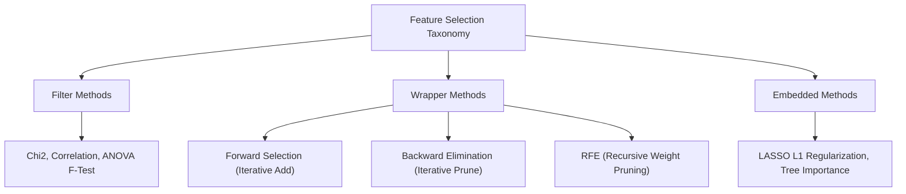

# Chi-Square Test & Wrapper Feature Selection Algorithms

[← Back to Course README](../README.md)

- [1. Chi-Square Test of Categorical Independence](#1-chi-square-test-of-categorical-independence)
- [2. Information Gain & Mutual Information Selection](#2-information-gain-mutual-information-selection)
- [3. Wrapper Feature Selection Algorithms](#3-wrapper-feature-selection-algorithms)
  - [3.1 Forward Feature Selection](#31-forward-feature-selection)
  - [3.2 Backward Feature Elimination](#32-backward-feature-elimination)
  - [3.3 Recursive Feature Elimination (RFE)](#33-recursive-feature-elimination-rfe)
- [4. Degradation Effects of Irrelevant Features](#4-degradation-effects-of-irrelevant-features)
- [5. Scikit-Learn Python Feature Selection Suite](#5-scikit-learn-python-feature-selection-suite)
- [6. Industry Case Study: High-Dimensional Gene Expression Selection](#6-industry-case-study-high-dimensional-gene-expression-selection)
- [7. 5 Solved Analytical & Numerical Practice Questions](#7-5-solved-analytical-numerical-practice-questions)
  - [Question 1: Chi-Square Statistic Derivation](#question-1-chi-square-statistic-derivation)
  - [Question 2: Information Gain Calculation](#question-2-information-gain-calculation)
  - [Question 3: Sequential Backward Elimination Step](#question-3-sequential-backward-elimination-step)
  - [Question 4: RFE Feature Weight Ranking](#question-4-rfe-feature-weight-ranking)
  - [Question 5: Noise Feature KNN Performance Drop](#question-5-noise-feature-knn-performance-drop)
> **Topic**: Chi-Square Test & Wrapper Feature Selection Algorithms: 1. Chi-Square Test of Categorical Independence, 2. Information Gain & Mutual Information Selection, 3. Wrapper Feature Selection Algorithms, 4. Degradation Effects of Irrelevant Features

---

## 1. Chi-Square Test of Categorical Independence

Evaluates statistical dependence between non-negative categorical feature $A$ and target class $Y$:

$$\chi^2 = \sum_{i=1}^r \sum_{j=1}^c \frac{(O_{ij} - E_{ij})^2}{E_{ij}}$$

Where $E_{ij} = \frac{R_i \cdot C_j}{N}$ is expected frequency under null hypothesis $H_0$ (Independence).

---

## 2. Information Gain & Mutual Information Selection

Measures entropy reduction after splitting dataset $S$ on feature $A$:

$$IG(S, A) = H(S) - \sum_{v \in \text{Values}(A)} \frac{|S_v|}{|S|} H(S_v)$$

Where Shannon entropy $H(S) = -\sum p_i \log_2(p_i)$.

---

## 3. Wrapper Feature Selection Algorithms



### 3.1 Forward Feature Selection
Starts with empty set $S = \emptyset$. Iteratively adds feature $x_j$ maximizing validation performance score until stopping criteria is met.

### 3.2 Backward Feature Elimination
Starts with full feature set $S = \mathcal{F}$. Iteratively prunes feature $x_j$ whose removal minimizes validation score drop.

### 3.3 Recursive Feature Elimination (RFE)
Fits base estimator, ranks features by weight magnitudes $|w_j|$, and recursively prunes lowest-ranked features.

---

## 4. Degradation Effects of Irrelevant Features

Adding noisy, irrelevant features expands hypothesis space capacity, causes distance-based models (KNN, SVM) to fail due to distance dilution, and increases model variance.

---

## 5. Scikit-Learn Python Feature Selection Suite

```python
from sklearn.datasets import make_classification
from sklearn.feature_selection import SelectKBest, chi2, RFE
from sklearn.linear_model import LogisticRegression

# Create synthetic dataset with 5 informative and 15 noise features
X_raw, y_raw = make_classification(n_samples=200, n_features=20, n_informative=5, random_state=42)

# Non-negative transformation for Chi2
X_pos = X_raw - X_raw.min()

# 1. Filter Selection: Chi2
chi2_selector = SelectKBest(score_func=chi2, k=5).fit(X_pos, y_raw)
print(f"Chi2 Selected Top 5 Feature Indices: {chi2_selector.get_support(indices=True)}")

# 2. Wrapper Selection: RFE
rfe_selector = RFE(estimator=LogisticRegression(), n_features_to_select=5).fit(X_raw, y_raw)
print(f"RFE Selected Top 5 Feature Indices:  {rfe_selector.get_support(indices=True)}")
```

---

## 6. Industry Case Study: High-Dimensional Gene Expression Selection

```python
import numpy as np
import pandas as pd
from sklearn.feature_selection import SequentialFeatureSelector
from sklearn.tree import DecisionTreeClassifier

# 50 samples, 100 gene features
X_genes = np.random.normal(0, 1, (50, 100))
y_disease = np.random.choice([0, 1], size=50)

# Sequential Forward Selection to find top 3 diagnostic genes
sfs = SequentialFeatureSelector(
    DecisionTreeClassifier(max_depth=3, random_state=42),
    n_features_to_select=3,
    direction='forward',
    cv=3
).fit(X_genes, y_disease)

print(f"Diagnostic Gene Feature Indices Selected: {np.where(sfs.get_support())[0]}")
```

---

## 7. 5 Solved Analytical & Numerical Practice Questions

### Question 1: Chi-Square Statistic Derivation
**Problem**: Calculate $\chi^2$ statistic for $2 \times 2$ table `[[20, 10], [10, 20]]`.
```python
# Solution
from scipy.stats import chi2_contingency

obs = np.array([[20, 10], [10, 20]])
chi2_stat, p_val, dof, _ = chi2_contingency(obs, correction=False)
print(f"Question 1 -> Chi2 Stat: {chi2_stat:.4f}, p-value: {p_val:.4e}, dof: {dof}") # chi2 = 6.6667, dof = 1
```

### Question 2: Information Gain Calculation
**Problem**: Dataset $S$ has 50 Positive and 50 Negative samples ($H(S) = 1.0$). Feature $A$ splits $S$ into $S_1$ (30 Pos, 10 Neg) and $S_2$ (20 Pos, 40 Neg). Compute $IG(S, A)$.
```python
# Solution
import math

def entropy(p1, p2):
    if p1 == 0 or p2 == 0: return 0
    t = p1 + p2
    return -( (p1/t)*math.log2(p1/t) + (p2/t)*math.log2(p2/t) )

h_s = 1.0
h_s1 = entropy(30, 10) # ~0.8113
h_s2 = entropy(20, 40) # ~0.9183

n_s, n_s1, n_s2 = 100, 40, 60
ig = h_s - ( (n_s1/n_s)*h_s1 + (n_s2/n_s)*h_s2 )
print(f"Question 2 -> Information Gain IG(S, A): {ig:.4f}")
```

### Question 3: Sequential Backward Elimination Step
**Problem**: Fit models dropping one feature at a time from set $\{f_1, f_2, f_3\}$ and output feature whose removal maximizes score.
```python
# Solution
from sklearn.metrics import accuracy_score

# Dummy evaluation function
scores = {'f1_removed': 0.85, 'f2_removed': 0.92, 'f3_removed': 0.78}
best_prune = max(scores, key=scores.get)
print(f"Question 3 -> Backward Elimination Prunes: {best_prune} (Score: {scores[best_prune]:.2f})")
```

### Question 4: RFE Feature Weight Ranking
**Problem**: Linear model weight vector is $w = [2.5, -4.8, 0.1, -0.02]$. Identify feature pruned first by RFE.
```python
# Solution
weights = np.array([2.5, -4.8, 0.1, -0.02])
abs_weights = np.abs(weights)
pruned_idx = np.argmin(abs_weights)
print(f"Question 4 -> RFE Prunes Feature Index: {pruned_idx} (Weight magnitude: {abs_weights[pruned_idx]})")
```

### Question 5: Noise Feature KNN Performance Drop
**Problem**: Evaluate 5-fold KNN cross-validation accuracy on 5 informative features vs 5 informative + 20 noise features.
```python
# Solution
from sklearn.neighbors import KNeighborsClassifier
from sklearn.model_selection import cross_val_score

np.random.seed(42)
X_clean, y_clean = make_classification(n_samples=200, n_features=5, random_state=42)
X_noise = np.hstack([X_clean, np.random.normal(0, 1, (200, 20))])

score_clean = cross_val_score(KNeighborsClassifier(), X_clean, y_clean, cv=5).mean()
score_noise = cross_val_score(KNeighborsClassifier(), X_noise, y_clean, cv=5).mean()

print(f"Question 5 -> Clean Acc: {score_clean:.4f}, Noise Acc: {score_noise:.4f} (Degraded due to noise)")
```
