<div align="center">

# Machine Learning
### Course Code: ICS 235 | ICAS, MAHE
**Machine learning foundations, supervised learning (Linear/Logistic Regression, Decision Trees, Random Forests, SVMs, Naive Bayes, k-NN), unsupervised learning (k-Means, Hierarchical Clustering, PCA, t-SNE), model evaluation & hyperparameter tuning, ensemble methods (Gradient Boosting, XGBoost), and introduction to Neural Networks & Deep Learning.**

[](https://manipal.edu/icas.html)
[](#academic-course-information)
[](#academic-course-information)
[](https://www.python.org/)
[](https://pytorch.org/)

<br/>

<table width="100%">
  <tr align="center">
    <td>
      <b>7 Modules</b><br/>
      <sub>Core ML Curriculum</sub>
    </td>
    <td>
      <b>36 Hours</b><br/>
      <sub>Course Hours</sub>
    </td>
    <td>
      <b>16 Notes & Notebook Files</b><br/>
      <sub>ML & DL Modules</sub>
    </td>
    <td>
      <b>Python / PyTorch</b><br/>
      <sub>Machine Learning Stack</sub>
    </td>
  </tr>
</table>

</div>

---

### Academic Course Information

| Academic Attribute | Course Details & Specs |
| :--- | :--- |
| **Course Structure (L-T-P-C)** | 3-0-0-3 (3 Lecture Credits, 0 Tutorial Credits, 0 Practical Credits, 3 Total Course Credits) |
| **Contact Hours** | 36 Lecture Hours |
| **Curriculum Distribution** | 36 Hours (3h Intro + 4h Preprocessing + 4h Feature Eng. + 7h Supervised + 6h Unsupervised + 6h Ensembles + 6h Neural Nets) |
| **Academic Level & Semester** | 2nd Year, Semester IV (Computer Science & Engineering) |

---

### Project Metrics

```toml
[academic.course_info]
institution       = "International Centre for Applied Sciences (ICAS)"
university        = "Manipal Academy of Higher Education (MAHE)"
course_code       = "ICS 235"
course_title      = "Machine Learning"
credits_structure = "3-0-0-3"
academic_level    = "2nd Year"
semester          = "Semester IV"

[repository.metadata]
ml_modules           = 7
total_lecture_hours  = 36
notes_files_count    = 18
core_stack           = "Python / Scikit-Learn / SciPy / PyTorch / Pandas"
curriculum_status    = "100% [████████████████████████████████████████]"

[curriculum.distribution.hours]
introduction_and_paradigms          = 3
data_cleaning_and_preprocessing    = 4
feature_engineering_and_eda        = 4
supervised_learning_techniques      = 7
unsupervised_learning_techniques    = 6
model_assessment_and_ensembles      = 6
neural_networks_and_deep_learning   = 6
```

---

### Coursework Pipeline

```mermaid
flowchart LR
    %% Styles
    classDef primary fill:#2a2b36,stroke:#007acc,stroke-width:1.5px,color:#ffffff;

    A["1. Intro & Paradigms<br/>(3h: VC Dim, PAC, Bias-Var)"]:::primary
    B["2. Preprocessing & Scaling<br/>(4h: Imputation, Z-Score, One-Hot)"]:::primary
    C["3. Feature Engineering & EDA<br/>(4h: Chi2, Information Gain, RFE)"]:::primary
    D["4. Supervised Learning<br/>(7h: OLS, Trees, KNN, Bayes, SVM)"]:::primary
    E["5. Unsupervised Learning<br/>(6h: K-Means, GMM, Hierarchical)"]:::primary
    F["6. Ensembles & Assessment<br/>(6h: Bagging, Boosting, Stacking)"]:::primary
    G["7. Neural Networks & DL<br/>(6h: MLP, Backprop, CNN, RNN)"]:::primary

    A --> B
    B --> C
    C --> D
    D --> E
    E --> F
    F --> G
```



---

### Course Modules Directory

| Chapter Module | Covered Syllabus Concepts | Key Markdown Notes |
| :--- | :--- | :--- |
| **01 Intro & Paradigms (3 Hours)** | ML paradigms (Supervised, Unsupervised, Semi-Supervised, Reinforcement), perspectives & issues, hypothesis evaluation, VC-dimension ($\text{VC}(\mathcal{H})$), PAC learning, Bias-Variance Trade-Off ($\text{Bias}^2 + \text{Var} + \sigma^2$), applications. | • [ml-paradigms-and-foundations.md](01-introduction-and-paradigms/ml-paradigms-and-foundations.md)<br/>• [bias-variance-tradeoff-vc-dimension.md](01-introduction-and-paradigms/bias-variance-tradeoff-vc-dimension.md) |
| **02 Cleaning & Preprocessing (4 Hours)** | Identifying missing values (MCAR/MAR/MNAR), listwise deletion, mean/median/mode/KNN imputation, Z-score outlier detection ($|Z|>3$), Min-Max scaling, Standardization, deduplication, One-Hot encoding. | • [data-cleaning-imputation-scaling.md](02-data-cleaning-preprocessing/data-cleaning-imputation-scaling.md) |
| **03 Feature Engineering & EDA (4 Hours)** | Dataset understanding, Univariate (skewness/kurtosis), Bivariate (scatter/boxplots), Multivariate pairplots, Pearson correlation $r$, Spearman rank $\rho$, Chi-square $\chi^2$ test, Information Gain, Wrapper methods (Forward, Backward, RFE), irrelevant feature effects. | • [eda-univariate-bivariate-multivariate.md](03-feature-engineering-eda/eda-univariate-bivariate-multivariate.md)<br/>• [correlation-analysis.md](03-feature-engineering-eda/correlation-analysis.md)<br/>• [chi-square-and-feature-selection.md](03-feature-engineering-eda/chi-square-and-feature-selection.md) |
| **04 Supervised Learning (7 Hours)** | Classification Decision Trees, split impurity (Entropy, Gini Index, Information Gain), Logistic Regression, Sigmoid $\sigma(z)$, KNN, Naive Bayes (Gaussian, Multinomial), OLS Linear Regression, Support Vector Machines (Hyperplanes, Margin, Soft-margin $C$, Kernel Trick RBF/Poly). | • [linear-regression-and-logistic-regression.md](04-supervised-learning/linear-regression-and-logistic-regression.md)<br/>• [decision-trees-and-split-measures.md](04-supervised-learning/decision-trees-and-split-measures.md)<br/>• [k-nearest-neighbors.md](04-supervised-learning/k-nearest-neighbors.md)<br/>• [naive-bayes-classifier.md](04-supervised-learning/naive-bayes-classifier.md)<br/>• [support-vector-machines.md](04-supervised-learning/support-vector-machines.md) |
| **05 Unsupervised Learning (6 Hours)** | Engineering unlabeled data, K-Means clustering, WCSS Inertia, Expectation-Maximization (EM) algorithm, Gaussian Mixture Models (GMM), Hierarchical clustering (Agglomerative, Divisive, Linkage methods). | • [kmeans-and-gmm-em-clustering.md](05-unsupervised-learning/kmeans-and-gmm-em-clustering.md)<br/>• [hierarchical-clustering.md](05-unsupervised-learning/hierarchical-clustering.md) |
| **06 Assessment & Ensembles (6 Hours)** | Batch vs Rank-Ordered assessment (Gain/Lift charts), Regression metrics (MSE, RMSE, MAE, $R^2$), Confusion Matrix, ROC-AUC, Multicollinearity VIF, Bagging, Out-of-Bag (OOB) error, Random Forests ($m=\sqrt{d}$), Boosting (AdaBoost, GBDT), Heterogeneous Ensembles (Voting, Stacking). | • [confusion-matrix-and-model-assessment.md](06-model-assessment-ensembles/confusion-matrix-and-model-assessment.md)<br/>• [roc-auc-curve-analysis.md](06-model-assessment-ensembles/roc-auc-curve-analysis.md)<br/>• [multicollinearity-diagnostics.md](06-model-assessment-ensembles/multicollinearity-diagnostics.md)<br/>• [bagging-random-forests.md](06-model-assessment-ensembles/bagging-random-forests.md)<br/>• [boosting-gradient-boosting-adaboost.md](06-model-assessment-ensembles/boosting-gradient-boosting-adaboost.md) |
| **07 Neural Networks & DL (6 Hours)** | Single Layer Perceptron, Multilayer Perceptron (MLP), activation functions (ReLU, Sigmoid, Softmax), Backpropagation gradient chain rule, Convolutional Neural Networks (CNN: Conv2D, Pooling), Recurrent Neural Networks (RNN, LSTM). | • [neural-networks-mlp-cnn-rnn.md](07-neural-networks-deep-learning/neural-networks-mlp-cnn-rnn.md) |

---

### Text / Reference Books
1. **Gopinath Rebala, Ajay Ravi, Sanjay Churiwala**, *An Introduction to Machine Learning*, Springer, 2019.
2. **Miroslav Kubat**, *An Introduction to Machine Learning*, 2nd Edition, Springer, 2017.
3. **Ethem Alpaydin**, *Introduction to Machine Learning*, 2nd Edition, MIT Press, 2010.
4. **Mehryar Mohri, Afshin Rostamizadeh, and Ameet Talwalkar**, *Foundations of Machine Learning*, MIT Press, 2012.

---

### Technical Guide

<details>
<summary><b>Running Machine Learning Scripts</b></summary>

```bash
# Set up virtual environment
python -m venv venv
source venv/bin/activate  # On Windows: .\venv\Scripts\activate

# Install required dependencies
pip install numpy pandas matplotlib seaborn scipy scikit-learn torch statsmodels
```
</details>
